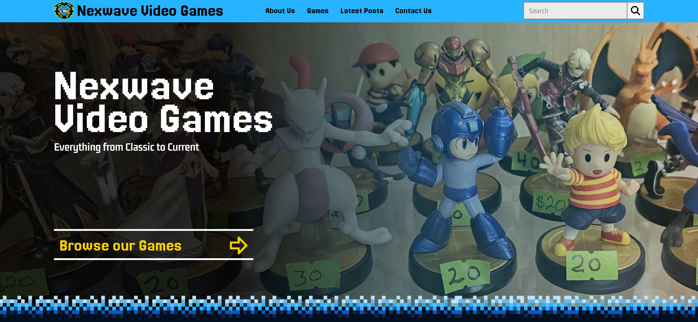
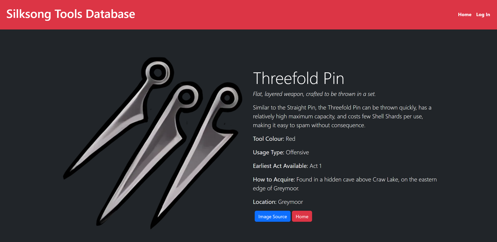

# Jacob Kombedjian | Web Designer

## Hey there, welcome to my page!
My name is Jacob Kombedjian. I am a detail-oriented and technically skilled Web Designer with two years of experience through academic studies. Throughout my time in post secondary education, I have gained the ability to learn and maintain different CMS-driven websites, while building responsive layouts using HTML, CSS, JavaScript, PHP and plenty of different frameworks. I am also proficient in utilising Search Engine Optimisation tools to increase website performance, and have substantial experience in collaborative work.

## I’m currently learning:
- Liquid

## Known Languages:
- 
- 
- 
-  (Still Learning)
-  (Still Learning)

## Framework Experience
Through my time in education I have learned many frameworks, these are a few are the main ones I have uitilised.
-     

## Hosting Services
- Shopify
- 

## Design Skills
As a designer I strive to improve my usage of these applications consistently.
-    	  	

## Portfolio Pieces
(Note:) All of these are post secondary projects, as I gain more experience this list will be updated!

### Nexwave Video Games
https://nexwavevideogames.com/ (Opening Soon!)

Nexwave Video Games is a used game store based in Edmonton, Alberta. The owner wanted a website not to sell their products online, but to catalogue the store's inventory in order to drive in person traffic. We were tasked with making a modern website with a retro style, to keep up this style we went with blocky text/svgs and absolutely zero roundness on borders. I am the lead designer on this project, and with the design fully completed, me and my team are currently the finalisation period. In the process,I have had to learn how to use shopify for hosting and liquid as a framework. We have gained valuable experience dealing with problems and working together to create the best possible website for our client with our current skillset.

### Silksong Tools Database

The Silksong Tools Database is exactly as it sounds, a database used to showcase tools from the video game Hollow Knight Silksong, as well as allowing users to favourite specified tools. It was a group project with the soul purpose of utilising PHP, MySQL and employing group responsibilities through the use of a shared GitHub Repo. My task was mainly to do a lot of manual databasing, this started out as inputting SQL code into a VSCode file and eventually grew into utilising the website itself to add in new items. Depending on if you had admin permissions or not, if you were to log in you may or may not have the ability to add items. The process made me extremely familiar with manual databasing and I consider it a great learning experience.

## How to reach me:
I'm available for contact throughout any of my social media accounts, however, your best bet to reach me quick is through Email or Discord.
### Email:
jkombedjian@gmail.com
### Discord:
Volcanic
